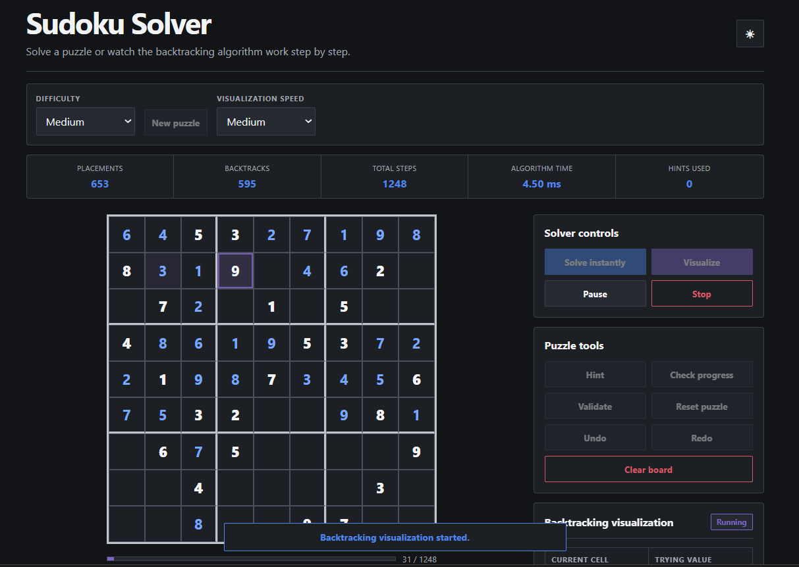

# Sudoku Solver & Backtracking Visualizer

A responsive Sudoku application built with HTML, CSS, and vanilla JavaScript. It can solve Sudoku puzzles instantly or visualize the recursive backtracking algorithm step by step with live placements, backtracks, candidate values, and recursion depth.

## Live Demo

[Play Sudoku Solver](https://ujjwal-1267.github.io/Sudoku-Solver/)

## Preview



## Features

### Solver & Visualization

* Recursive backtracking solver
* Step-by-step backtracking visualization
* Live placement and backtrack highlighting
* Current cell, attempted value, valid candidates, and recursion depth
* Pause, resume, and stop controls
* Multiple visualization speed options
* Progress bar and live solver statistics
* Unique and multiple-solution detection
* Unsolvable puzzle detection

### Puzzle Tools

* Easy, medium, hard, and expert preset puzzles
* Manual puzzle entry
* Input validation and conflict highlighting
* Hint system
* Check-progress feature
* Undo and redo
* Reset puzzle and clear board
* Automatic completion detection
* Keyboard navigation and mobile number pad

### Interface

* Responsive desktop and mobile layout
* Light and dark themes
* Automatic progress saving with `localStorage`
* Saved progress restoration after refresh
* Row, column, box, and matching-number highlighting
* Accessible keyboard focus states and ARIA labels

## Technologies Used

* HTML5
* CSS3
* JavaScript
* DOM Manipulation
* Recursion & Backtracking
* Browser `localStorage`

## Project Structure

```text
Sudoku-Solver/
├── index.html
├── style.css
├── script.js
├── README.md
└── assets/
    └── preview.png
```

## How the Solver Works

The solver uses recursive backtracking:

1. Find an empty cell.
2. Calculate all valid candidates.
3. Place one candidate.
4. Continue recursively.
5. If a dead end is reached, remove the value and backtrack.
6. Repeat until the puzzle is solved.

The algorithm uses the **Minimum Remaining Values (MRV)** strategy by selecting the empty cell with the fewest legal candidates first, reducing unnecessary recursive branches.

## Keyboard Controls

* Arrow keys → Move between cells
* `1-9` → Enter value
* `Backspace`, `Delete`, or `0` → Clear value
* `Ctrl + Z` → Undo
* `Ctrl + Y` or `Ctrl + Shift + Z` → Redo

## Run Locally

```bash
git clone https://github.com/Ujjwal-1267/Sudoku-Solver.git
cd Sudoku-Solver
```

Open `index.html` in a browser or use the **Live Server** extension in VS Code.

## What I Learned

Through this project, I practised:

* Recursive problem solving
* Backtracking algorithms
* Candidate-based search optimization
* DOM state synchronization
* Step-by-step algorithm visualization
* Undo and redo implementation
* Browser storage handling
* Responsive UI design
* Accessibility fundamentals
